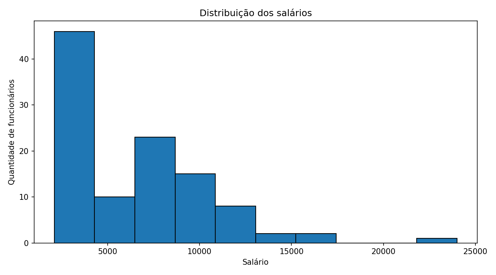
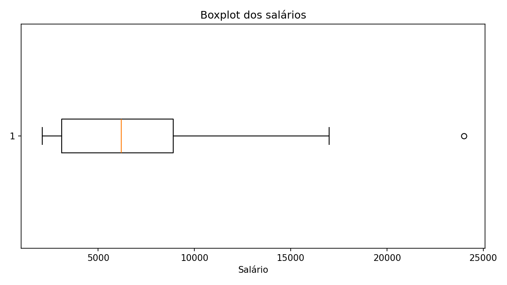
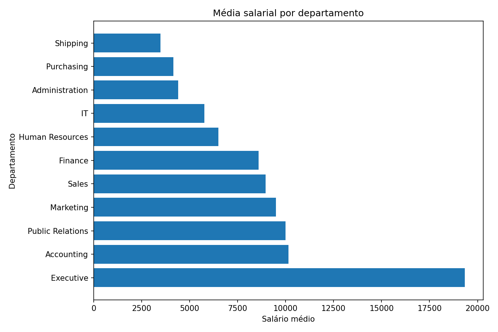
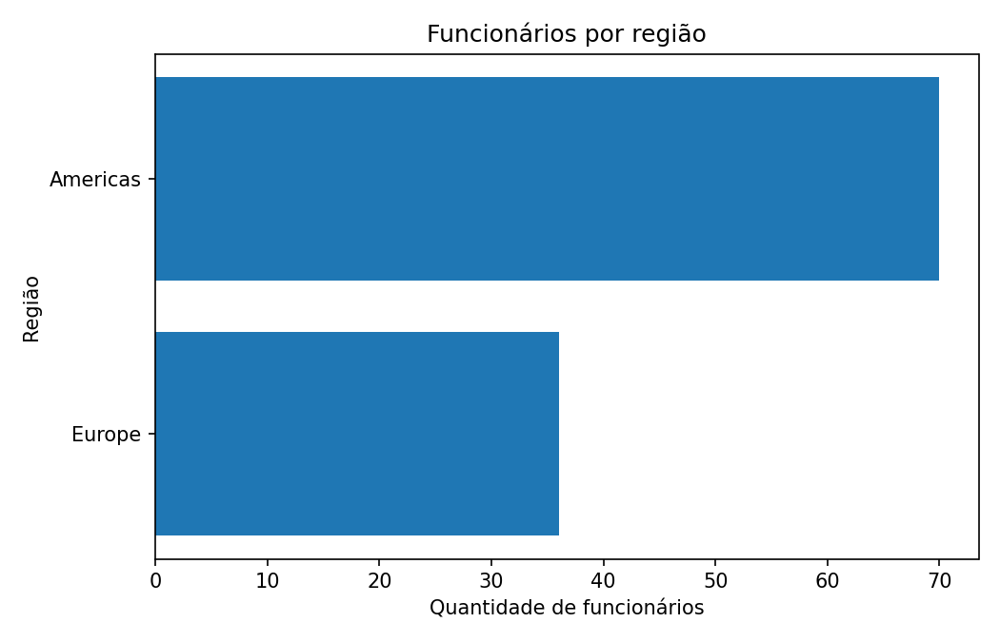

# Projeto de Recuperação - Análise de Dados de Recursos Humanos

## 1. Identificação

**Curso:** Carreira Tech - Trilha Análise de Dados  
**Módulo:** Modelagem de Dados  
**Atividade:** M1S14 - Projeto de Recuperação Módulo 1  
**Aluno:** Carolina da Silva Corrêa  

## 2. Objetivo do projeto

O objetivo deste projeto é analisar dados de Recursos Humanos utilizando o esquema **HR (Human Resources)**.

A análise busca responder duas perguntas principais:

1. Como os salários dos funcionários estão distribuídos entre os departamentos e cargos?
2. Como os funcionários estão distribuídos entre cidades, países e regiões?

Para isso, foram utilizadas consultas SQL com `LEFT JOIN` e `WHERE`, seguidas de uma análise exploratória simples em Python.

## 3. Tabelas utilizadas

### Query 1

Foram utilizadas:

- `HR.EMPLOYEES`: informações dos funcionários e salários.
- `HR.DEPARTMENTS`: informações dos departamentos.
- `HR.JOBS`: informações dos cargos.

### Query 2

Foram utilizadas:

- `HR.EMPLOYEES`
- `HR.DEPARTMENTS`
- `HR.LOCATIONS`
- `HR.COUNTRIES`
- `HR.REGIONS`

Essas tabelas permitem relacionar o funcionário ao departamento, cidade, país e região.

## 4. Consultas SQL

### Query 1 - Salários por departamento e cargo

A primeira consulta relaciona funcionários, departamentos e cargos.

Foram utilizados dois `LEFT JOIN`:

- `EMPLOYEES` com `DEPARTMENTS`;
- `EMPLOYEES` com `JOBS`.

Também foi utilizado um filtro `WHERE e.SALARY IS NOT NULL`.

O código está em:

`sql/query_01.sql`

### Query 2 - Distribuição por localidade

A segunda consulta relaciona funcionários, departamentos, locais, países e regiões.

Foram utilizados quatro `LEFT JOIN` para percorrer o relacionamento:

**Funcionário → Departamento → Local → País → Região**

O código está em:

`sql/query_02.sql`

Foi utilizado o filtro:

`WHERE r.REGION_NAME IS NOT NULL`

## 5. Análise em Python

Os resultados das consultas foram exportados para CSV e analisados com Python utilizando as bibliotecas:

- Pandas
- Matplotlib

O código está em:

`python/analise_hr.py`

A análise contém:

- quantidade de linhas e colunas;
- visualização inicial dos dados;
- tipos de dados;
- verificação de valores ausentes;
- média salarial;
- mediana salarial;
- menor salário;
- maior salário;
- média salarial por departamento;
- média salarial por cargo;
- quantidade de funcionários por região;
- quantidade de funcionários por país;
- quantidade de funcionários por cidade;
- identificação de outliers utilizando o método do IQR;
- histograma;
- boxplot;
- gráfico de média salarial por departamento;
- gráfico de funcionários por região.

## 6. Resultados encontrados

A base analisada possui **107 funcionários**.

### Estatísticas salariais

| Medida | Resultado |
|---|---:|
| Média | 6.461,83 |
| Mediana | 6.200,00 |
| Mínimo | 2.100,00 |
| Máximo | 24.000,00 |

A média ficou um pouco acima da mediana. Isso acontece principalmente porque existem alguns salários mais altos que aumentam a média.

### Departamentos

O departamento com maior média salarial foi **Executive**, com aproximadamente **19.333,33**.

O departamento com maior quantidade de funcionários foi **Shipping**, com **45 funcionários**, seguido por **Sales**, com **34 funcionários**.

### Cargos

O maior salário individual encontrado foi de **24.000**, correspondente ao cargo **President**.

Entre os cargos com mais funcionários, destaca-se **Sales Representative**, com 30 funcionários.

### Distribuição geográfica

A análise encontrou funcionários em duas regiões:

- **Americas:** 70 funcionários;
- **Europe:** 36 funcionários.

Os países com funcionários foram principalmente:

- United States of America: 68;
- United Kingdom of Great Britain and Northern Ireland: 35;
- Canada: 2;
- Germany: 1.

As cidades com maior quantidade de funcionários foram:

- South San Francisco: 45;
- Oxford: 34;
- Seattle: 18;
- Southlake: 5;
- Toronto: 2;
- Munich: 1;
- London: 1.

## 7. Análise dos outliers

Foi utilizado o método do **Intervalo Interquartil (IQR)**.

- Q1 = 3.100
- Q3 = 8.900
- IQR = 5.800
- Limite inferior = -5.600
- Limite superior = 17.600

Foi identificado **1 outlier**, com salário de **24.000**, referente ao cargo de President.

Esse outlier é importante porque mostra que a distribuição salarial não é totalmente homogênea. O salário do cargo de maior responsabilidade é muito superior à maior parte dos salários da base e influencia a média salarial.

## 8. Principais insights

### Insight 1 - A média salarial é influenciada pelos salários mais altos

A média foi de 6.461,83, enquanto a mediana foi de 6.200. A diferença não é muito grande, mas mostra uma influência dos salários maiores.

### Insight 2 - Shipping possui muitos funcionários, mas não a maior média salarial

Shipping concentra 45 funcionários, mas apresenta média salarial de aproximadamente 3.475,56.

Isso mostra que quantidade de funcionários não significa necessariamente maior custo médio por funcionário.

### Insight 3 - Executive possui a maior média salarial

O departamento Executive possui apenas três funcionários, mas apresentou média salarial de aproximadamente 19.333,33.

### Insight 4 - A distribuição geográfica está concentrada

A maior parte dos funcionários está nos Estados Unidos e no Reino Unido. South San Francisco e Oxford concentram grande parte dos funcionários da base.

### Insight 5 - O salário de President é um outlier

O salário de 24.000 ficou acima do limite superior calculado pelo IQR. Esse resultado precisa ser considerado ao analisar a média salarial geral.

## 9. Gráficos

### Distribuição dos salários



### Boxplot dos salários



### Média salarial por departamento



### Funcionários por região



## 10. Como executar o projeto

### 1. Instalar Python

É necessário ter Python instalado.

### 2. Abrir o projeto no VS Code

Abra a pasta do projeto no Visual Studio Code.

### 3. Instalar as bibliotecas

No terminal:

```bash
pip install -r requirements.txt
```

### 4. Executar a análise

No terminal:

```bash
python python/analise_hr.py
```

O programa irá ler:

```text
data/query_01.csv
data/query_02.csv
```

e gerar os gráficos na pasta:

```text
graficos/
```

## 11. Organização do projeto

```text
projeto_hr_eda/
│
├── README.md
├── requirements.txt
├── .gitignore
│
├── sql/
│   ├── query_01.sql
│   └── query_02.sql
│
├── data/
│   ├── query_01.csv
│   ├── query_02.csv
│   ├── export_employees_original.csv
│   └── export_departments_original.csv
│
├── python/
│   └── analise_hr.py
│
└── graficos/
    ├── histograma_salarios.png
    ├── boxplot_salarios.png
    ├── media_salarial_departamento.png
    └── funcionarios_regiao.png
```

## 12. Melhorias futuras

Para uma próxima versão, poderiam ser realizadas análises adicionais, como:

- comparar o salário atual com a faixa mínima e máxima de cada cargo;
- analisar tempo de empresa;
- analisar salários por tempo de experiência;
- comparar salários entre países;
- analisar a distribuição das comissões;
- criar um dashboard interativo;
- analisar a adequação salarial para novas contratações.

## 13. Checklist de entrega

- [x] Query 1 em SQL
- [x] Query 2 em SQL
- [x] CSV da Query 1
- [x] CSV da Query 2
- [x] Análise em Python
- [x] Estatísticas básicas
- [x] Histograma
- [x] Boxplot
- [x] README.md
- [x] Gráficos
- [ ] Criar repositório público no GitHub
- [ ] Criar branches e commits
- [ ] Gravar vídeo de até 7 minutos
- [ ] Enviar os três links no AVA

## 14. Observação sobre os arquivos CSV

Os dois arquivos enviados para esta preparação foram `export.csv` (EMPLOYEES) e `export-2.csv` (DEPARTMENTS). Eles correspondem aos dados do esquema HR utilizado no projeto.

Os arquivos `query_01.csv` e `query_02.csv` desta pasta foram organizados a partir desses dados e das relações do esquema HR para deixar a análise completa e reproduzível.

Para a entrega final, é recomendável executar as duas consultas da pasta `sql/` diretamente no FreeSQL e exportar novamente os resultados com os nomes `query_01.csv` e `query_02.csv`. Dessa forma, os CSVs ficam comprovadamente como resultados das queries executadas no ambiente solicitado pela atividade.

## 15. Referências

O esquema HR utilizado é o esquema de exemplo de Recursos Humanos da Oracle. A documentação oficial descreve as tabelas EMPLOYEES, DEPARTMENTS, JOBS, LOCATIONS, COUNTRIES e REGIONS e seus relacionamentos.
